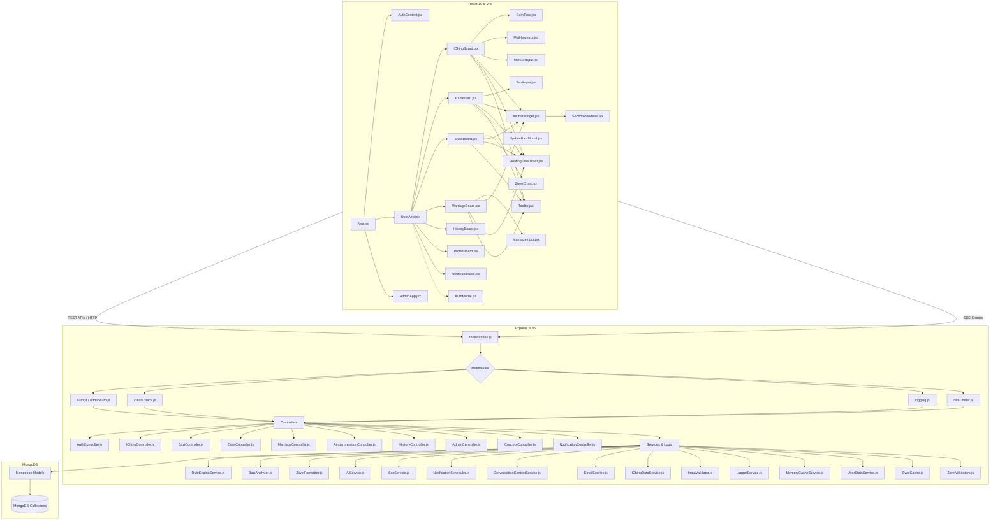
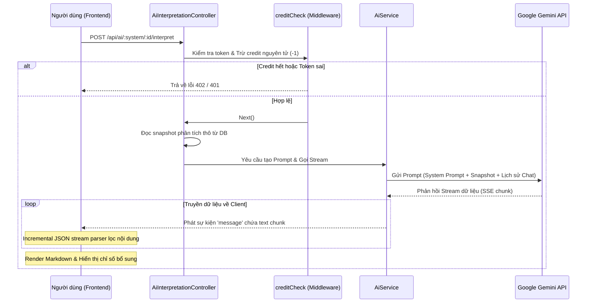

# 🏛️ ARCHITECTURE.md - Kiến trúc Hệ thống

## 1. Sơ đồ Kiến trúc Tổng quan (High-Level Architecture)

Hệ thống hoạt động theo mô hình Client-Server rời rạc, giao tiếp thông qua RESTful API và Server-Sent Events (SSE) để truyền dữ liệu thời gian thực.



---

## 2. Luồng Xử lý Dữ liệu Chính (Core Data Flows)

### 2.1 Luồng Luận giải AI qua SSE (Kinh Dịch, Bát Tự, Tử Vi, Hợp Hôn)
Luồng này thực hiện truyền tải văn bản thời gian thực (Server-Sent Events) từ Google Gemini API tới Frontend cho tất cả các phân hệ học thuật:



### 2.2 Đồng bộ hóa hoàn toàn các Luồng Luận giải AI
Tất cả các phân hệ Kinh Dịch, Bát Tự, Tử Vi và Hợp Hôn hiện nay đều đã chuyển sang chạy trực tiếp và phát dòng dữ liệu (SSE Stream) thời gian thực. Hạ tầng hàng đợi bất đồng bộ trước đây (`JobQueueService.js` và bảng dữ liệu `AstrologyJob`) đã bị **xóa bỏ hoàn toàn** để làm sạch dự án và tránh các mã nguồn dư thừa.

---

## 3. Các Middleware & Hệ thống Kiểm soát

Hệ thống Express.js sử dụng chuỗi Middleware để bảo vệ tài nguyên, phân quyền và ghi nhận nhật ký hành vi:

1. **`logging.js` (Audit Logging):**
   - Đánh chặn tất cả các yêu cầu.
   - Giải mã token để lấy thông tin Email, IP, Hành động thực tế, Thời gian xử lý.
   - Masking (ẩn) các thông tin nhạy cảm như mật khẩu trước khi lưu vào `SystemLog` trong MongoDB.
2. **`auth.js` / `adminAuth.js` (Authentication & Authorization):**
   - Xác thực JWT token từ Header Authorization `Bearer <token>` hoặc query parameter `?token=`.
   - Đối chiếu trường `tokenVersion` từ payload token JWT với giá trị thực tế trong cơ sở dữ liệu. Nếu người dùng đã thực hiện đăng xuất (logout), `tokenVersion` của họ trong DB sẽ tăng lên, lập tức làm vô hiệu hóa token cũ này và trả về `401 Unauthorized`.
   - Kiểm tra tài khoản có bị khóa (`status === 'locked'`) hoặc xóa mềm (`isDeleted === true`) không.
   - `adminAuth.js` đính kèm thêm helper `req.hasAuthorityOver(targetUser)` để ngăn Co-Admin thao tác trên Admin khác.
3. **`creditCheck.js` (Credit Quota Protection):**
   - Kiểm tra và trừ 1 credit nguyên tử trên tài khoản của người dùng trước khi chuyển tiếp yêu cầu tới AI.
   - Bỏ qua kiểm tra đối với các tài khoản Admin / Co-Admin.
4. **`rateLimiter.js` (Rate Limiting):**
   - Giới hạn tần suất gọi API (ví dụ: tối đa 30 lần lập lá số trong 15 phút, 20 lần gọi AI trong 15 phút) để tránh tấn công DDOS hoặc spam API tốn phí.
   - Tích hợp kiến trúc **Hybrid Rate Limiter & Redis Pipeline**: Đóng gói các lệnh `INCR` và `PTTL` trong 1 gói tin TCP duy nhất (Redis Pipeline) giúp phản hồi tức thì, tự động fallback về bộ nhớ RAM JavaScript `Map` nếu Redis bị trễ quá 200ms hoặc ngắt kết nối.
5. **`MemoryCacheService.js` & `redis.js` (Hybrid L1 RAM + L2 Redis Caching):**
   - Bộ nhớ đệm 2 tầng chuẩn mực: **L1 RAM JS `Map`** (đọc trong 0.001ms từ RAM Node.js Heap) + **L2 Redis** (độ trễ 2ms).
   - Tích hợp cơ chế **Hard Timeout Wrapper (`withTimeout`) tối đa 300ms - 500ms** cho tất cả thao tác Redis, kích hoạt `family: 4` chống trễ DNS IPv6 AAAA trên AWS EC2, cùng TCP Keep-Alive 5000ms ngăn ngắt socket từ AWS NAT Gateway.
6. **`checkRecordOwnership.js` (Record Privacy Protection):**
   - Tự động xác định loại bản ghi (Kinh Dịch, Bát Tự, Tử Vi, Hợp Hôn) dựa trên URL API và thực hiện truy vấn cơ sở dữ liệu để bảo vệ quyền riêng tư.
   - Chỉ cho phép chủ sở hữu của bản ghi hoặc quản trị viên (Admin/Co-Admin) xem chi tiết, yêu cầu giải đoán AI, hoặc chat AI liên quan đến bản ghi đó. Chặn đứng các hành vi dùng ID để xem lén dữ liệu của người khác.
   - Cho phép khách truy cập bản ghi do khách (guest) tự lập.
7. **`checkHistoryOwnership.js` (History Access Protection):**
   - Ngăn chặn người dùng xem trộm lịch sử của tài khoản khác bằng cách đối chiếu ID người dùng trong token JWT với `:userId` trên endpoint API.
8. **`optionalAuth.js` (Optional Authentication):**
   - Thực hiện giải mã thông tin token từ Redis User Profile Cache và gán vào `req.user` & `req.dbUser` (chuẩn hóa đầy đủ `id` và `_id`).
   - Nếu token bị hết hạn hoặc không hợp lệ, middleware sẽ âm thầm bỏ qua (`next()`) thay vì ném lỗi HTTP 401, đảm bảo không ngắt luồng hiển thị lịch sử của khách hoặc người dùng vừa đổi phiên.

---

## 4. Cơ chế Đồng bộ & Realtime (Server-Sent Events)

Hệ thống triển khai dịch vụ [SseService.js](file:///t:/Phongthuy/backend/src/services/SseService.js) để duy trì kết nối thời gian thực:
- **Admin Channel (`/api/admin/events`):** Đăng ký các kết nối của Admin để cập nhật live hoạt động của người dùng, lượt chạy API, khiếu nại tài khoản.
- **User Channel (`/api/auth/events`):** Lắng nghe các thay đổi về quyền hạn (Role), số dư credit hoặc lệnh khóa tài khoản từ admin. Nếu tài khoản bị khóa hoặc xóa từ Admin Panel, Client sẽ nhận được sự kiện qua SSE và tự động thực hiện đăng xuất (F5/Clear localStorage) ngay lập tức.
- **SSE Keepalive Ping:** Mọi kết nối SSE đều được đăng ký vào vòng lặp heartbeat gửi gói tin trống `:\n\n` định kỳ 15 giây nhằm duy trì kết nối luôn sống qua các cổng reverse proxy.

---

## 5. Hạ tầng Bảo mật & Resilience (Security & Resilience Infrastructure)

- **Helmet Security Headers:** Tích hợp `helmet` bảo vệ các HTTP response headers (`X-Frame-Options`, `X-Content-Type-Options: nosniff`, `Strict-Transport-Security`, `X-DNS-Prefetch-Control`).
- **Global Error Handling Middleware:** Tập trung xử lý toàn bộ uncaught errors trong Express.js v5 qua middleware 4 tham số, ghi nhận log lỗi chi tiết và trả về JSON tiêu chuẩn cho Client.
- **Graceful Shutdown & Process Lifecycle:** Tự động lắng nghe `uncaughtException`, `unhandledRejection`, `SIGTERM`, `SIGINT` để ngắt nhận request mới (`server.close()`), đóng kết nối MongoDB an toàn trước khi gọi `process.exit(1)` kích hoạt cơ chế tự phục hồi (Self-Healing Container) trên AWS ECS / Docker.
- **Log Rotation (Daily Rotate):** Tích hợp `winston-daily-rotate-file` chia nhỏ tệp log theo ngày (`app-%DATE%.log` và `errors-%DATE%.log`), giới hạn 10MB/tệp, tự động nén `.gz` và dọn dẹp log quá 14 ngày.
- **Automated Unit Testing (Jest):** Tích hợp khung thử nghiệm `jest` tự động với **19 Test Suites (86/86 Tests PASSED)** xác minh kết quả an sao Bát Tự Ngũ Hành 4.0, Tử Vi 12 Cung, Quẻ Kinh Dịch, RuleEngineService, DateService, Controllers và các Middleware bảo mật.

---

## 5. Cơ chế Sao lưu & Đồng bộ Google Drive (Backup System)

Để bảo vệ tính toàn vẹn của dữ liệu người dùng, lá số đã gieo, lịch sử chat và tài khoản, hệ thống áp dụng cơ chế sao lưu độc lập ở cấp độ hạ tầng (Host-level Cronjob) thay vì tích hợp sâu vào tiến trình Node.js Backend.

### 5.1 Sơ đồ Quy trình Backup & Đồng bộ
```mermaid
graph TD
    Cron[OS Cron Daemon - 00:00] -->|Kích hoạt| BackupSh[backup.sh]
    BackupSh -->|Khởi chạy| MongoContainer[Docker Container mongo:8]
    MongoContainer -->|mongodump --uri| DB[(MongoDB Atlas)]
    DB -->|Xuất dữ liệu| RawBackup[Dữ liệu backup thô]
    BackupSh -->|Nén tar.gz| LocalArchive[mongodb_date.tar.gz]
    LocalArchive -->|Lưu cục bộ| LocalDir[Thư mục /backups - Giữ tối đa 7 file]
    
    BackupSh -->|Kích hoạt| UploadSh[upload_drive.sh]
    UploadSh -->|rclone copy| GDrive[(Google Drive: backup/mongo_atlas)]
    
    BackupSh -->|Kích hoạt| CleanSh[cleanup_drive.sh]
    CleanSh -->|rclone deletefile| GDrive
    Note over CleanSh: Chỉ giữ lại 30 file mới nhất trên Drive
```

### 5.2 Lợi ích Thiết kế Kiến trúc
- **Tách biệt Tiến trình (Process Isolation):** Tác vụ nén và upload tốn CPU/RAM được xử lý bởi cronjob hệ điều hành và chạy qua container Docker phụ trợ ngắn hạn, tránh hiện tượng nghẽn Event Loop của Express.js hoặc làm crash máy chủ web khi lượng dữ liệu lớn.
- **Tính tự lập cao:** Ngay cả khi Node.js Backend gặp sự cố ngừng hoạt động, tác vụ backup vẫn hoạt động độc lập và gửi dữ liệu lên đám mây bình thường.
- **Tiết kiệm tài nguyên:** Các container và tiến trình backup chỉ được sinh ra trong thời gian ngắn lúc 00:00 đêm và tự động bị tiêu hủy (`--rm`) ngay sau khi hoàn thành.
