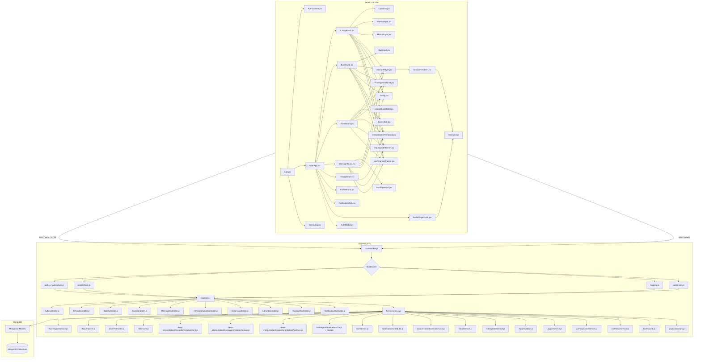
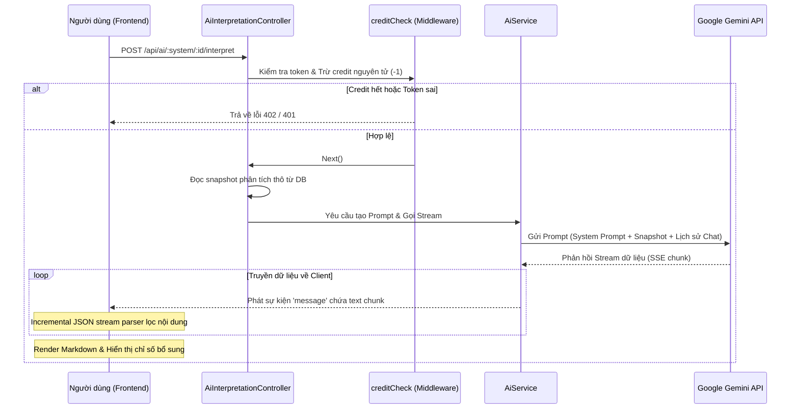
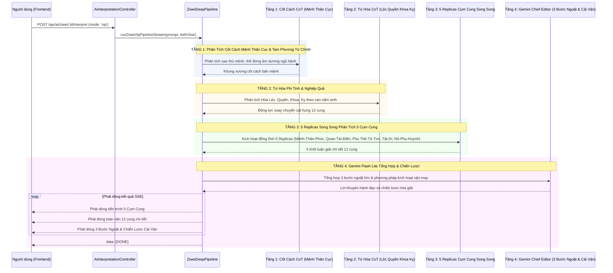
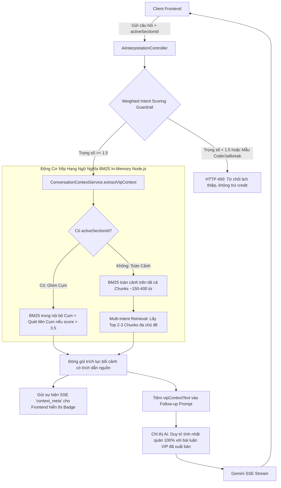
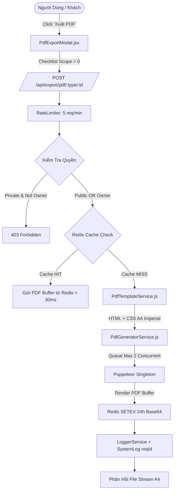

# 🏛️ ARCHITECTURE.md - Kiến trúc Hệ thống

## 1. Sơ đồ Kiến trúc Tổng quan (High-Level Architecture)

Hệ thống hoạt động theo mô hình Client-Server rời rạc, giao tiếp thông qua RESTful API và Server-Sent Events (SSE) để truyền dữ liệu thời gian thực.



---

## 2. Luồng Xử lý Dữ liệu Chính (Core Data Flows)

### 2.1 Luồng Luận giải AI qua SSE (Kinh Dịch, Bát Tự, Tử Vi, Hợp Hôn)
Luồng này thực hiện truyền tải văn bản thời gian thực (Server-Sent Events) từ Google Gemini API tới Frontend cho tất cả các phân hệ học thuật:



### 2.2 Đồng bộ hóa hoàn toàn các Luồng Luận giải AI
Tất cả các phân hệ Kinh Dịch, Bát Tự, Tử Vi và Hợp Hôn hiện nay đều đã chuyển sang chạy trực tiếp và phát dòng dữ liệu (SSE Stream) thời gian thực. Hạ tầng hàng đợi bất đồng bộ trước đây (`JobQueueService.js` và bảng dữ liệu `AstrologyJob`) đã bị **xóa bỏ hoàn toàn** để làm sạch dự án và tránh các mã nguồn dư thừa.

### 2.3 Luồng Multi-Agent VIP Pipeline (Bát Tự 3 Tầng & Tử Vi 4 Tầng Phân Tích Chuyên Sâu)
Hạ tầng Luận giải Chuyên sâu VIP được tổ chức tập trung tại `backend/src/services/deep-interpretation/` (gồm `DeepInterpretationCore.js`, `DeepInterpretationConfigs.js`, `DeepInterpretationPipelines.js`, và facade `MultiAgentPipelineService.js`).

#### A. Quy trình Bát Tự VIP Pipeline (3 Tầng Phân Tích Chuyên Sâu)
Tạo ra công trình nghiên cứu mệnh lý toàn diện 6.500+ từ (~34.000 ký tự) qua 6 Chương học thuật và chuyên đề Điều Hòa Chiến Lược:

```mermaid
sequenceDiagram
    participant User as Người dùng (Frontend)
    participant Ctrl as AiInterpretationController
    participant Pipeline as BaziDeepPipeline
    participant Tier1 as Tầng 1: CoT & Master Timeline (Gemini + Qwen Plus)
    participant Tier2 as Tầng 2: 6 Replicas Parallel (Qwen Plus / Gemini Flash Lite)
    participant Tier3 as Tầng 3: Gemini Chief Editor & Strategic Harmonizer

    User->>Ctrl: POST /api/ai/bazi/:id/interpret (mode: 'vip')
    Ctrl->>Pipeline: runBaziVipPipelineStream(prompt, birthYear)
    
    rect rgb(240, 245, 255)
    Note over Pipeline,Tier1: TẦNG 1: Phân Tích Cốt Lõi Song Song & Khóa Master Timeline (~20s)
    Pipeline->>Tier1: Gọi đồng thời Qwen Plus (Mệnh Cách CoT + Timeline) + Gemini (Dụng Thần)
    Tier1-->>Pipeline: Trả về 2 bản phân tích xương sống & mốc niên biểu vàng
    end

    rect rgb(255, 250, 240)
    Note over Pipeline,Tier2: TẦNG 2: 6 Replicas Chuyên Sâu Song Song (~35s)
    Pipeline->>Tier2: Kích hoạt đồng thời 6 Replicas cho 6 Chương
    Note over Tier2: Ch1, Ch2 (Qwen Plus); Ch3, Ch4, Ch5, Ch6 (Gemini SDK trực tiếp)
    Tier2-->>Pipeline: 6 bài phân tích chi tiết của 6 Chương (~32.000 ký tự)
    end

    rect rgb(240, 255, 240)
    Note over Pipeline,Tier3: TẦNG 3: Gemini Tổng Biên Tập Thẩm Định & Điều Hòa (~8s)
    Pipeline->>Tier3: Gửi TOÀN BỘ 6 Chương + CoT Tầng 1 vào Gemini 1M Context Window
    Tier3-->>Pipeline: 1. Dẫn nhập & SWOT thực chiến 100% chiết xuất từ 6 chương
    Tier3-->>Pipeline: 2. Chiến lược điều hòa đa mục tiêu & Master Action Roadmap
    
    loop Phát dòng toàn văn 100% không nén
        Pipeline-->>User: Phát dòng Dẫn nhập SWOT
        Pipeline-->>User: Phát dòng 100% nguyên bản Chương 1 -> Chương 6
        Pipeline-->>User: Phát dòng Chiến lược Điều hòa Đa mục tiêu & Đúc kết
    end
    Pipeline-->>User: data: [DONE]
    end
```

#### B. Quy trình Tử Vi Đẩu Số VIP Pipeline (4 Tầng Phân Tích Chuyên Sâu 5 Cụm Cung Toàn Đồ)
Tổ chức phân tích tinh vi 12 cung chức theo 5 Cụm tương hỗ kết hợp Tứ Hóa phi tinh:



#### C. Quy trình Hợp Hôn VIP Pipeline (4 Trụ Cột Hạnh Phúc & Gia Đạo)
Tổ chức phân tích tương thích hai bản mệnh Bát Tự chuyên sâu qua 4 Trụ cột cốt lõi:
- **Tầng 1 (CoT Tương Quan Hai Bản Mệnh):** Phân tích tương tác giữa 2 Nhật Chủ, Thập Thần đối chiếu, Cung Phi Bát Trạch, và các cặp Lục Hợp/Tam Hợp/Lục Xung/Tam Hình.
- **Tầng 2 (4 Replicas Song Song - 4 Trụ Cột):**
  + Trụ 1: Cốt Cách & Tâm Lý Hai Bản Thể (Nhu cầu cảm xúc, phong cách giao tiếp, nguyên nhân rạn nứt tiềm ẩn).
  + Trụ 2: Tài Chính & Quản Trị Tổ Ấm Gia Đình (Trụ cột kinh tế, phân bổ dòng tiền chung, phong cách đầu tư gia đình).
  + Trụ 3: Hóa Giải Xung Khắc & Phong Thủy Phòng Cưới (Phương vị phòng ngủ, màu sắc trang trí, vật phẩm ngũ hành điều hòa).
  + Trụ 4: Con Cái, Dòng Tộc & Lộ Trình Vận Trình Trăm Năm (Thời điểm sinh nở đại cát, cách thức giáo dục con cái, niên biểu đồng hành).
- **Tầng 3 (Gemini Chief Editor & Strategic Harmonizer):** Tổng hợp ma trận hòa hợp, phác đồ đồng thuận hôn nhân bền vững và lời khuyên tu dưỡng tổ ấm.

#### D. Quy trình Kinh Dịch VIP Pipeline (3 Kịch Bản Tương Lai & Đạo Dịch Thực Chiến)
Tổ chức biện chứng Lục Hào cổ điển kết hợp dự phóng đa kịch bản hành động:
- **Tầng 1 (CoT Biện Chứng Lục Hào Cốt Lõi):** Phân tích Quẻ Thể - Dụng, tương quan Thế - Ứng, Hào Động và vượng suy Dụng Thần theo Nguyệt Lệnh/Nhật Kiến.
- **Tầng 2 (3 Replicas Song Song - 3 Khối Học Thuật):**
  + Khối 1: Biện Chứng Lục Hào & Động Hào Cát Hung (Giải mã ý nghĩa từng hào, hào biến, vượng suy thế ứng).
  + Khối 2: 3 Kịch Bản Diễn Tiến Tương Lai (Bảng so sánh 3 kịch bản: Thuận dòng - Nghịch cảnh - Đột phá kèm xác suất và rủi ro).
  + Khối 3: Mốc Thời Gian Ứng Kỳ & Chiến Lược Hành Động (Địa Chi tháng/ngày ứng nghiệm, diệu kế hành động theo Đạo Dịch).
- **Tầng 3 (Gemini Chief Editor & Strategic Harmonizer):** Tổng kết ma trận SWOT, phân định cơ hội/thách thức và đúc kết lời khuyên trí tuệ Dịch học.

### 2.4 Cơ Chế Đồng Bộ Ngữ Cảnh VIP Chat Follow-up & Động Cơ Ngữ Nghĩa BM25 In-Memory (Hybrid VIP Context Memory)
Để hỗ trợ người dùng hỏi đáp chuyên sâu (Follow-up Chat) trên các bài luận giải VIP có độ dài từ 4.000 - 7.000 từ mà không làm quá tải token context window (~11.000 tokens) và tránh AI bị loãng thông tin, hệ thống triển khai kiến trúc **Native In-Memory Semantic Engine** tại `ConversationContextService.js` gồm 3 thành phần chính:



- **Weighted Intent Scoring Guardrail:**
  + Quét và chặn đứng tuyệt đối mẫu câu lập trình, code, công nghệ hoặc jailbreak lồng từ khóa phong thủy (-5.0 điểm).
  + Tính điểm trọng số dương: Thuật ngữ cổ học (+3.0), Quyết định đời sống (+2.0), Bế tắc & Trăn trở nhân sinh (+1.5), Thỉnh giáo hội thoại (+1.5), Thời tiết (+1.5).
  + Ngưỡng duyệt `score >= 1.5`: Vừa an toàn tuyệt đối trước jailbreak vừa thấu hiểu trăn trở nhân sinh tự nhiên.
- **Okapi BM25 In-Memory ($k_1=1.2, b=0.75$):**
  + Tách đoạn văn thành các khối ngữ nghĩa (Semantic Chunks ~150-400 từ).
  + Tách từ tiếng Việt Unigram + Bigram (`tokenize`).
  + Tính toán trực tiếp trên RAM Node.js Heap với độ trễ < 2ms, độ phức tạp $O(N)$, không phụ thuộc API ngoài.
- **Multi-Intent Context Banner:**
  + Phát sự kiện `context_meta` qua SSE để hiển thị huy hiệu đa ngữ cảnh (`🏷️ Ngữ cảnh đa chiều: ... + ...`) trên giao diện người dùng `AiChatWidget.jsx`.
- **Tiết kiệm tài nguyên:** Giảm kích thước prompt từ ~11.000 tokens xuống chỉ còn ~1.500 tokens/lượt chat, tăng tốc độ phản hồi ban đầu (Time-to-First-Token) xuống dưới 1.2s.
- **Tính nhất quán tuyệt đối:** AI follow-up bám sát và kế thừa toàn bộ phân tích thần sát, cách cục, đại vận và lời khuyên đã được tổng hợp ở bài luận chính, loại bỏ hiện tượng mâu thuẫn câu trả lời.

### 2.5 Động Cơ Đọc Âm Thanh Kép (Dual-Audio TTS Engine) & Đồng Bộ Trực Quan Karaoke Sync
Để nâng tầm trải nghiệm của người dùng khi theo dõi các bản luận giải chuyên sâu (4.000 - 7.000 từ), hệ thống cung cấp động cơ âm thanh kép (Dual-Audio TTS) kết hợp hài hòa giữa chất lượng cao và tốc độ phản hồi tức thời:

```mermaid
flowchart TD
    SectionCard[SectionCard (Header Bar)] -->|Nhấn 🔊 Nghe đọc| PlayAction[ttsEngine.playSection]
    
    subgraph TTSEngineCore [Động Cơ Dual-Audio Singleton - ttsEngine.js]
        PlayAction --> Normalizer[NLP Text Normalizer: Phiên âm ký hiệu cổ học M, V, Đ, H, Tứ Hóa & Bảng Markdown]
        Normalizer --> Chunker[Sentence Chunking: Tách câu thông minh < 180 ký tự]
        Chunker --> GenderCheck{Chế độ Giọng Đọc}
        
        GenderCheck -->|Giọng Nữ AI| GoogleTTS[Endpoint Backend Proxy: /api/tts?text=...&lang=vi]
        GoogleTTS --> LRUCache[In-Memory LRU Cache 500 câu (0ms)]
        LRUCache --> HTML5Audio[HTML5 Audio: Google Natural Voice MP3 ngọt ngào]
        
        GenderCheck -->|Giọng Nam| WebSpeech[Native Web Speech API: SAPI Microsoft An trầm ấm]
        WebSpeech --> KeepAlive[Chromium Keepalive: Heartbeat Ping vi mô 10s chống freeze]
        KeepAlive --> UtteranceSpeak[window.speechSynthesis.speak]
    end

    HTML5Audio --> StateNotify[ttsEngine._notify: Phát sự kiện tới các listeners]
    UtteranceSpeak --> StateNotify
    
    subgraph ReactiveUI [Giao Diện Phản Ứng Thời Gian Thực]
        StateNotify --> KaraokeSync[SectionRenderer: Khung trích dẫn Karaoke Realtime Highlight]
        StateNotify --> SectionBtn[SectionCard: Nút trạng thái Đang đọc với Equalizer 3 cột]
        StateNotify --> MasterDock[AudioPlayerDock: Nổi cố định đáy màn hình]
    end

    MasterDock --> Controls[Bảng Điều Khiển: Tua tiến trình Scrubber Thumb, Âm lượng 0-100%, Tốc độ 0.75x-1.5x, Đổi giọng Nữ/Nam, Đóng X]
    Controls --> TTSEngineCore
```

- **Kiến trúc Dual-Audio Đột Phá:**
  + **Giọng Nữ Chuẩn AI (Google Natural Voice MP3):** Truyền phát qua backend proxy `/api/tts` với bộ đệm in-memory LRU 500 câu. Đem lại chất giọng nữ ngọt ngào, truyền cảm, khắc phục 100% khiếm khuyết thiếu voice nữ trên hệ điều hành Windows SAPI.
  + **Giọng Nam (*"Thầy Luận Quẻ"*):** Sử dụng Native Web Speech API bản địa với giọng trầm ấm, đĩnh đạc, phản hồi 0ms.
- **Thanh Tiến Trình Tua Câu Tương Tác (Interactive Seek Bar):**
  + Người dùng có thể click hoặc kéo rê chuột (drag) trên thanh tiến trình để tua tức thời đến bất kỳ câu văn nào trong chương luận giải.
  + Tích hợp Scrubber Thumb và Tooltip xem trước số câu (`Câu X/Y`) khi rê chuột.
- **Điều Khiển Âm Lượng & Bật/Tắt Tiếng:**
  + Cụm icon `Volume2`/`VolumeX` kết hợp slider `0 - 100%` điều chỉnh âm lượng mượt mà, phản hồi ngay lập tức trên cả HTML5 Audio và Native Web Speech.
- **Điều Chỉnh Tốc Độ Phát Âm Thanh (0.75x - 1.5x):**
  + Hỗ trợ 4 mức: `0.75x`, `1.0x`, `1.25x`, `1.5x`. Cố định `defaultPlaybackRate` và `playbackRate` trên Audio Element chống tình trạng trình duyệt tự reset về 1.0x khi nạp câu mới.
- **Chuyên Biệt Hóa Giao Diện Theo 4 Phân Hệ Phong Thủy:**
  + Tự động đồng bộ màu sắc chủ đạo của modal, header gradient, waveform equalizer, thanh tiến trình, nút bấm và badge theo đúng phân hệ: **Tử Vi** (Tím / Chàm), **Bát Tự** (Xanh dương / Cyan), **Kinh Dịch** (Hổ phách / Cam), **Hôn Nhân** (Hồng ngọc / Rose).
- **Khắc Phục Hoàn Toàn Nút Đóng "X":**
  + Tự động reset `currentSectionId = null` và giải phóng audio stream khi nhấn nút X, đảm bảo modal đóng và unmount khỏi DOM ngay lập tức.

---

## 3. Các Middleware & Hệ thống Kiểm soát

Hệ thống Express.js sử dụng chuỗi Middleware để bảo vệ tài nguyên, phân quyền và ghi nhận nhật ký hành vi:

1. **`logging.js` (Audit Logging):**
   - Đánh chặn tất cả các yêu cầu.
   - Giải mã token để lấy thông tin Email, IP, Hành động thực tế, Thời gian xử lý.
   - Masking (ẩn) các thông tin nhạy cảm như mật khẩu trước khi lưu vào `SystemLog` trong MongoDB.
2. **`auth.js` / `adminAuth.js` (Authentication & Authorization):**
   - Xác thực JWT token từ Header Authorization `Bearer <token>` hoặc query parameter `?token=`.
   - Đối chiếu trường `tokenVersion` từ payload token JWT với giá trị thực tế trong cơ sở dữ liệu. Nếu người dùng đã thực hiện đăng xuất (logout), `tokenVersion` của họ trong DB sẽ tăng lên, lập tức làm vô hiệu hóa token cũ này và trả về `401 Unauthorized`.
   - Kiểm tra tài khoản có bị khóa (`status === 'locked'`) hoặc xóa mềm (`isDeleted === true`) không.
   - `adminAuth.js` đính kèm thêm helper `req.hasAuthorityOver(targetUser)` để ngăn Co-Admin thao tác trên Admin khác.
3. **`creditCheck.js` (Credit Quota Protection):**
   - Kiểm tra và trừ 1 credit nguyên tử trên tài khoản của người dùng trước khi chuyển tiếp yêu cầu tới AI.
   - Bỏ qua kiểm tra đối với các tài khoản Admin / Co-Admin.
4. **`rateLimiter.js` (Rate Limiting):**
   - Giới hạn tần suất gọi API (ví dụ: tối đa 30 lần lập lá số trong 15 phút, 20 lần gọi AI trong 15 phút) để tránh tấn công DDOS hoặc spam API tốn phí.
   - Tích hợp kiến trúc **Hybrid Rate Limiter & Redis Pipeline**: Đóng gói các lệnh `INCR` và `PTTL` trong 1 gói tin TCP duy nhất (Redis Pipeline) giúp phản hồi tức thì, tự động fallback về bộ nhớ RAM JavaScript `Map` nếu Redis bị trễ quá 200ms hoặc ngắt kết nối.
5. **`MemoryCacheService.js` & `redis.js` (Hybrid L1 RAM + L2 Redis Caching):**
   - Bộ nhớ đệm 2 tầng chuẩn mực: **L1 RAM JS `Map`** (đọc trong 0.001ms từ RAM Node.js Heap) + **L2 Redis** (độ trễ 2ms).
   - Tích hợp cơ chế **Hard Timeout Wrapper (`withTimeout`) tối đa 300ms - 500ms** cho tất cả thao tác Redis, kích hoạt `family: 4` chống trễ DNS IPv6 AAAA trên AWS EC2, cùng TCP Keep-Alive 5000ms ngăn ngắt socket từ AWS NAT Gateway.
6. **`checkRecordOwnership.js` (Record Privacy Protection):**
   - Tự động xác định loại bản ghi (Kinh Dịch, Bát Tự, Tử Vi, Hợp Hôn) dựa trên URL API và thực hiện truy vấn cơ sở dữ liệu để bảo vệ quyền riêng tư.
   - Chỉ cho phép chủ sở hữu của bản ghi hoặc quản trị viên (Admin/Co-Admin) xem chi tiết, yêu cầu giải đoán AI, hoặc chat AI liên quan đến bản ghi đó. Chặn đứng các hành vi dùng ID để xem lén dữ liệu của người khác.
   - Cho phép khách truy cập bản ghi do khách (guest) tự lập.
7. **`checkHistoryOwnership.js` (History Access Protection):**
   - Ngăn chặn người dùng xem trộm lịch sử của tài khoản khác bằng cách đối chiếu ID người dùng trong token JWT với `:userId` trên endpoint API.
8. **`optionalAuth.js` (Optional Authentication):**
   - Thực hiện giải mã thông tin token từ Redis User Profile Cache và gán vào `req.user` & `req.dbUser` (chuẩn hóa đầy đủ `id` và `_id`).
   - Nếu token bị hết hạn hoặc không hợp lệ, middleware sẽ âm thầm bỏ qua (`next()`) thay vì ném lỗi HTTP 401, đảm bảo không ngắt luồng hiển thị lịch sử của khách hoặc người dùng vừa đổi phiên.

---

## 4. Cơ chế Đồng bộ & Realtime (Server-Sent Events)

Hệ thống triển khai dịch vụ [SseService.js](file:///t:/Phongthuy/backend/src/services/SseService.js) để duy trì kết nối thời gian thực:
- **Admin Channel (`/api/admin/events`):** Đăng ký các kết nối của Admin để cập nhật live hoạt động của người dùng, lượt chạy API, khiếu nại tài khoản.
- **User Channel (`/api/auth/events`):** Lắng nghe các thay đổi về quyền hạn (Role), số dư credit hoặc lệnh khóa tài khoản từ admin. Nếu tài khoản bị khóa hoặc xóa từ Admin Panel, Client sẽ nhận được sự kiện qua SSE và tự động thực hiện đăng xuất (F5/Clear localStorage) ngay lập tức.
- **SSE Keepalive Ping:** Mọi kết nối SSE đều được đăng ký vào vòng lặp heartbeat gửi gói tin trống `:\n\n` định kỳ 15 giây nhằm duy trì kết nối luôn sống qua các cổng reverse proxy.

---

## 5. Hạ tầng Bảo mật & Resilience (Security & Resilience Infrastructure)

- **Helmet Security Headers:** Tích hợp `helmet` bảo vệ các HTTP response headers (`X-Frame-Options`, `X-Content-Type-Options: nosniff`, `Strict-Transport-Security`, `X-DNS-Prefetch-Control`).
- **Global Error Handling Middleware:** Tập trung xử lý toàn bộ uncaught errors trong Express.js v5 qua middleware 4 tham số, ghi nhận log lỗi chi tiết và trả về JSON tiêu chuẩn cho Client.
- **Graceful Shutdown & Process Lifecycle:** Tự động lắng nghe `uncaughtException`, `unhandledRejection`, `SIGTERM`, `SIGINT` để ngắt nhận request mới (`server.close()`), đóng kết nối MongoDB an toàn trước khi gọi `process.exit(1)` kích hoạt cơ chế tự phục hồi (Self-Healing Container) trên AWS ECS / Docker.
- **Log Rotation (Daily Rotate):** Tích hợp `winston-daily-rotate-file` chia nhỏ tệp log theo ngày (`app-%DATE%.log` và `errors-%DATE%.log`), giới hạn 10MB/tệp, tự động nén `.gz` và dọn dẹp log quá 14 ngày.
- **Automated Unit Testing (Jest):** Tích hợp khung thử nghiệm `jest` tự động với **19 Test Suites (86/86 Tests PASSED)** xác minh kết quả an sao Bát Tự Ngũ Hành 4.0, Tử Vi 12 Cung, Quẻ Kinh Dịch, RuleEngineService, DateService, Controllers và các Middleware bảo mật.

---

## 5. Cơ chế Sao lưu & Đồng bộ Google Drive (Backup System)

Để bảo vệ tính toàn vẹn của dữ liệu người dùng, lá số đã gieo, lịch sử chat và tài khoản, hệ thống áp dụng cơ chế sao lưu độc lập ở cấp độ hạ tầng (Host-level Cronjob) thay vì tích hợp sâu vào tiến trình Node.js Backend.

### 5.1 Sơ đồ Quy trình Backup & Đồng bộ
```mermaid
graph TD
    Cron[OS Cron Daemon - 00:00] -->|Kích hoạt| BackupSh[backup.sh]
    BackupSh -->|Khởi chạy| MongoContainer[Docker Container mongo:8]
    MongoContainer -->|mongodump --uri| DB[(MongoDB Atlas)]
    DB -->|Xuất dữ liệu| RawBackup[Dữ liệu backup thô]
    BackupSh -->|Nén tar.gz| LocalArchive[mongodb_date.tar.gz]
    LocalArchive -->|Lưu cục bộ| LocalDir[Thư mục /backups - Giữ tối đa 7 file]
    
    BackupSh -->|Kích hoạt| UploadSh[upload_drive.sh]
    UploadSh -->|rclone copy| GDrive[(Google Drive: backup/mongo_atlas)]
    
    BackupSh -->|Kích hoạt| CleanSh[cleanup_drive.sh]
    CleanSh -->|rclone deletefile| GDrive
    Note over CleanSh: Chỉ giữ lại 30 file mới nhất trên Drive
```

### 5.2 Lợi ích Thiết kế Kiến trúc
- **Tách biệt Tiến trình (Process Isolation):** Tác vụ nén và upload tốn CPU/RAM được xử lý bởi cronjob hệ điều hành và chạy qua container Docker phụ trợ ngắn hạn, tránh hiện tượng nghẽn Event Loop của Express.js hoặc làm crash máy chủ web khi lượng dữ liệu lớn.
- **Tính tự lập cao:** Ngay cả khi Node.js Backend gặp sự cố ngừng hoạt động, tác vụ backup vẫn hoạt động độc lập và gửi dữ liệu lên đám mây bình thường.
- **Tiết kiệm tài nguyên:** Các container và tiến trình backup chỉ được sinh ra trong thời gian ngắn lúc 00:00 đêm và tự động bị tiêu hủy (`--rm`) ngay sau khi hoàn thành.

---

## 6. Quy trình Tích hợp và Triển khai Liên tục (CI/CD Pipeline)

Hệ thống sử dụng **GitHub Actions** kết hợp **Docker Hub** để tự động hóa hoàn toàn quá trình triển khai mã nguồn lên máy chủ AWS EC2.

### 6.1 Sơ đồ Luồng CI/CD

```mermaid
sequenceDiagram
    autonumber
    participant Dev as Lập trình viên
    participant GH as GitHub Actions
    participant Hub as Docker Hub
    participant EC2 as AWS EC2

    Dev->>GH: 1. git push origin main
    
    rect rgb(30, 41, 59)
    note right of GH: Giai đoạn 1: Kiểm Thử (Testing)
    GH->>GH: 2. Tải Code & Cài đặt Node.js
    GH->>GH: 3. Chạy `npm test` (86/86 Jest Tests)
    GH-->>Dev: Nếu FAILED: Hủy build & Báo lỗi
    end

    rect rgb(30, 41, 59)
    note right of GH: Giai đoạn 2: Đóng Gói (Build)
    GH->>Hub: 4. Login vào Docker Hub
    GH->>GH: 5. Build Image (Sử dụng Cache GHA)
    GH->>Hub: 6. Đẩy 2 Image lên Docker Hub
    end

    rect rgb(30, 41, 59)
    note right of EC2: Giai đoạn 3: Triển Khai (Deploy)
    GH->>EC2: 7. Đăng nhập SSH bằng PEM Key
    GH->>EC2: 8. Tự động `git pull` & Cập nhật biến môi trường
    EC2->>Hub: 9. `docker compose pull`
    GH->>EC2: 10. `docker compose up -d` (Cập nhật In-place)
    GH->>EC2: 11. `docker compose restart nginx`
    end
```



### 6.2 Lợi Ích Của Luồng CI/CD Hiện Tại
- **Ngăn chặn lỗi trước khi lên sóng (Gatekeeping):** Unit Test chạy ngay vòng đầu, ngăn chặn việc triển khai nếu code bị lỗi logic.
- **Giảm tải EC2 (Offloading):** Toàn bộ quá trình build tốn kém RAM/CPU được đẩy sang Github, giúp máy chủ EC2 luôn ổn định (tránh sập web do out of memory).
- **Tốc độ build siêu nhanh (Layer Caching):** Việc tận dụng `setup-buildx-action` với `cache-from: type=gha` cho phép bỏ qua quá trình tải lại node_modules nếu `package.json` không thay đổi.
- **Thay ở đâu sửa ở đó (In-place Rolling Update):** Cơ chế thông minh của `docker compose up -d` đảm bảo chỉ những container bị thay đổi mã nguồn (image mới) mới bị khởi động lại, các container còn lại (DB, Redis) đạt trạng thái Zero-downtime.
- **Quản lý cấu hình tập trung (Single Source of Truth):** Sử dụng Github Secrets để nạp biến môi trường `${DOCKERHUB_USERNAME}` vào trực tiếp script deploy, giúp mã nguồn `docker-compose.yml` sạch sẽ, linh động.

---

## 7. Kiến Trúc Xuất Bản Tệp PDF Học Thuật (PDF Engine Architecture)

Nhằm đáp ứng nhu cầu in ấn và lưu trữ tài liệu luận giải cao cấp của người dùng mà không làm cạn kiệt tài nguyên máy chủ EC2 (1GB RAM), hệ thống thiết kế cơ chế **Headless Chromium Worker Singleton Pool** kết hợp **Redis Binary Caching (24h)**:



### 7.1 Bộ Điều Phối Tài Nguyên Puppeteer (Resource Optimization)
- **Singleton Browser Worker:** Không tạo instance trình duyệt mới cho mỗi request. Sử dụng chung 1 instance Chromium headless duy nhất với các cờ tối ưu hóa RAM (`--no-sandbox`, `--disable-setuid-sandbox`, `--disable-dev-shm-usage`, `--disable-gpu`).
- **Concurrent Limiter (Semaphore):** Giới hạn tối đa 2 tác vụ render song song (`maxConcurrent = 2`). Các request đến sau sẽ xếp hàng trong bộ đệm đợi thay vì ép máy chủ chạy tràn RAM.
- **Idle Auto-Close (5 phút):** Khi không có yêu cầu render mới trong vòng 5 phút, worker tự động đóng Chromium (`browser.close()`) để giải phóng 100-200MB RAM cho các tiến trình khác.
- **Fast Non-Blocking DOM Lifecycle:** Sử dụng cờ `waitUntil: 'domcontentloaded'` thay vì `networkidle0`, kết hợp bộ font hệ thống Linux (`fonts-liberation`, `Liberation Sans`, `Liberation Serif`) để triệt tiêu 100% rủi ro nghẽn mạng do Google Fonts ngoại, đẩy tốc độ render trang về < 1.5 giây.
- **Redis Binary Cache (24h):** Lưu trữ kết quả PDF dưới dạng base64 trong Redis với khóa cache `pdf:cache:<type>:<id>:<scopeKey>:<recordUpdatedMs>`. Các lần tải lại cùng nội dung phản hồi trong < 30ms và bỏ qua hoàn toàn Chromium.

### 7.2 Định Dạng Bố Cục In Ấn A4 (Eastern Imperial Luxury Print)
- **Chuẩn In Ấn A4:** Khổ A4 đứng (Portrait, margin: `10mm 12mm 12mm 12mm`). Sử dụng `@page` CSS và font chữ hoàng gia Phương Đông (`Cinzel`, `Noto Serif`, `Inter`).
- **Phân Tách Trang Thông Minh:** Các thẻ `no-break` (`page-break-inside: avoid`) giữ nguyên đồ hình tứ trụ, bảng đối chiếu hợp hôn hoặc đồ hình 6 hào trên cùng một trang giấy, tránh việc bị cắt đứt giữa chừng.
- **Ma Trận Đại Vận 2 Hàng x 5 Cột:** Thay thế thanh trượt ngang trên web bằng lưới 2x5 cố định (hàng trên 50 năm tiền vận, hàng dưới 50 năm hậu vận) kèm huy hiệu Cát/Hung theo Dụng Thần.

