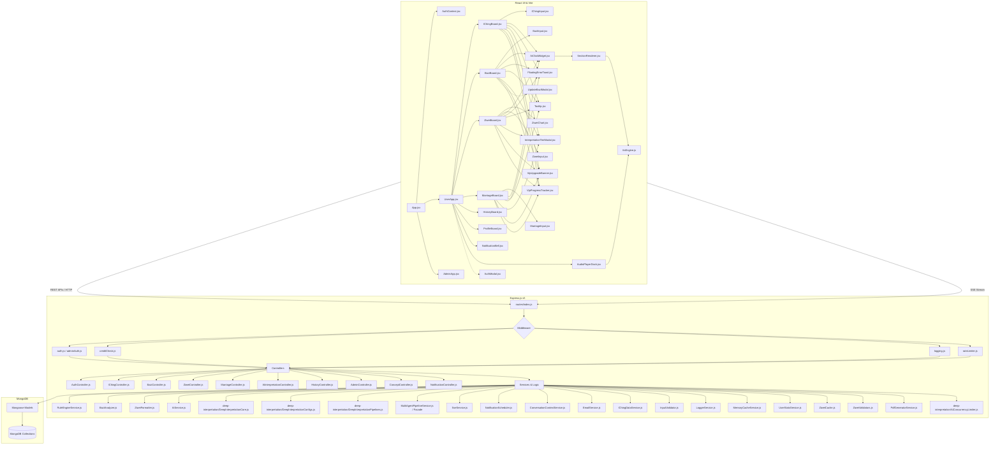
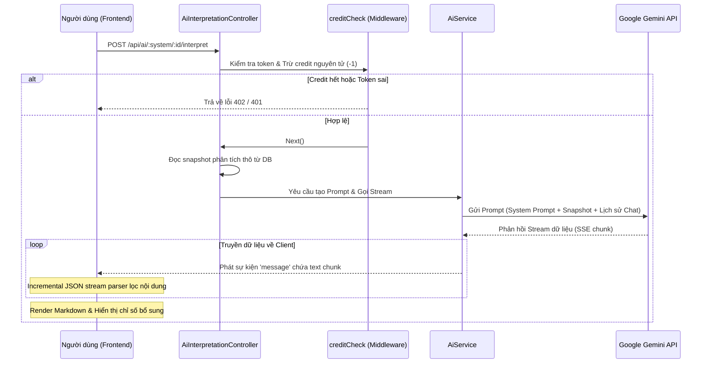
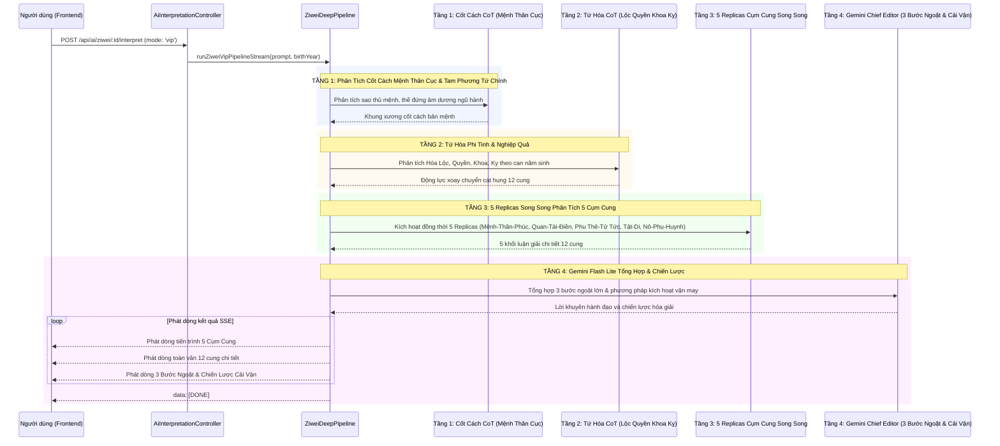
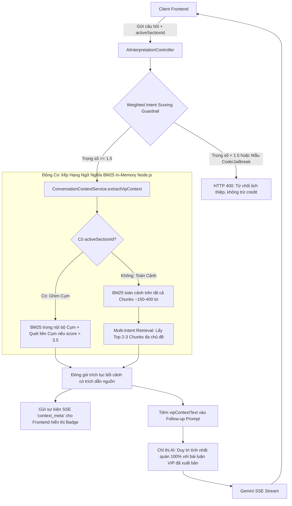
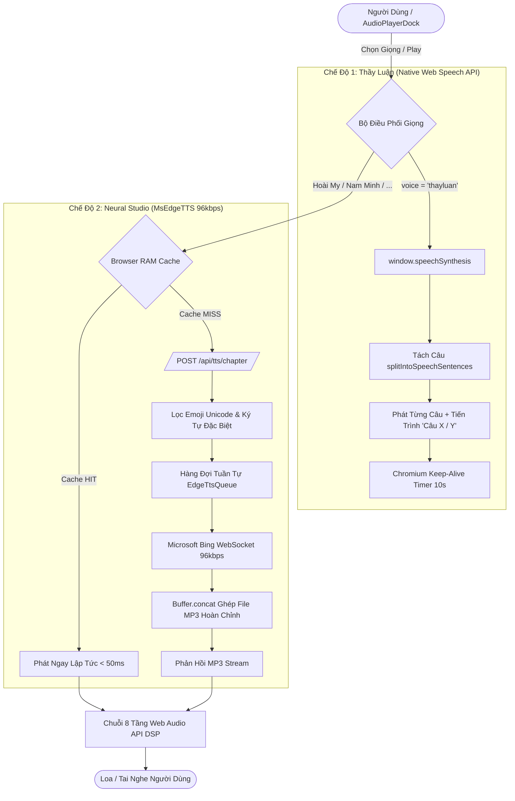

# 🏛️ ARCHITECTURE.md - Kiến trúc Hệ thống

## 1. Sơ đồ Kiến trúc Tổng quan (High-Level Architecture)

Hệ thống hoạt động theo mô hình Client-Server rời rạc, giao tiếp thông qua RESTful API và Server-Sent Events (SSE) để truyền dữ liệu thời gian thực.



---

## 2. Luồng Xử lý Dữ liệu Chính (Core Data Flows)

### 2.1 Luồng Luận giải AI qua SSE (Kinh Dịch, Bát Tự, Tử Vi, Hợp Hôn)
Luồng này thực hiện truyền tải văn bản thời gian thực (Server-Sent Events) từ Google Gemini API tới Frontend cho tất cả các phân hệ học thuật:



### 2.2 Đồng bộ hóa hoàn toàn các Luồng Luận giải AI
Tất cả các phân hệ Kinh Dịch, Bát Tự, Tử Vi và Hợp Hôn hiện nay đều đã chuyển sang chạy trực tiếp và phát dòng dữ liệu (SSE Stream) thời gian thực. Hạ tầng hàng đợi bất đồng bộ trước đây (`JobQueueService.js` và bảng dữ liệu `AstrologyJob`) đã bị **xóa bỏ hoàn toàn** để làm sạch dự án và tránh các mã nguồn dư thừa.

### 2.3 Luồng Multi-Agent VIP Pipeline (Bát Tự 3 Tầng & Tử Vi 4 Tầng Phân Tích Chuyên Sâu)
Hạ tầng Luận giải Chuyên sâu VIP được tổ chức tập trung tại `backend/src/services/deep-interpretation/` (gồm `DeepInterpretationCore.js`, `DeepInterpretationConfigs.js`, `DeepInterpretationPipelines.js`, và facade `MultiAgentPipelineService.js`).

#### A. Quy trình Bát Tự VIP Pipeline (3 Tầng Phân Tích Chuyên Sâu)
Tạo ra công trình nghiên cứu mệnh lý toàn diện 6.500+ từ (~34.000 ký tự) qua 6 Chương học thuật và chuyên đề Điều Hòa Chiến Lược:

```mermaid
sequenceDiagram
    participant User as Người dùng (Frontend)
    participant Ctrl as AiInterpretationController
    participant Pipeline as BaziDeepPipeline
    participant Tier1 as Tầng 1: CoT & Master Timeline (Gemini + Qwen Plus)
    participant Tier2 as Tầng 2: 6 Replicas Parallel (Qwen Plus / Gemini Flash Lite)
    participant Tier3 as Tầng 3: Gemini Chief Editor & Strategic Harmonizer

    User->>Ctrl: POST /api/ai/bazi/:id/interpret (mode: 'vip')
    Ctrl->>Pipeline: runBaziVipPipelineStream(prompt, birthYear)
    
    rect rgb(240, 245, 255)
    Note over Pipeline,Tier1: TẦNG 1: Phân Tích Cốt Lõi Song Song & Khóa Master Timeline (~20s)
    Pipeline->>Tier1: Gọi đồng thời Qwen Plus (Mệnh Cách CoT + Timeline) + Gemini (Dụng Thần)
    Tier1-->>Pipeline: Trả về 2 bản phân tích xương sống & mốc niên biểu vàng
    end

    rect rgb(255, 250, 240)
    Note over Pipeline,Tier2: TẦNG 2: 6 Replicas Chuyên Sâu Song Song (~35s)
    Pipeline->>Tier2: Kích hoạt đồng thời 6 Replicas cho 6 Chương
    Note over Tier2: Ch1, Ch2 (Qwen Plus); Ch3, Ch4, Ch5, Ch6 (Gemini SDK trực tiếp)
    Tier2-->>Pipeline: 6 bài phân tích chi tiết của 6 Chương (~32.000 ký tự)
    end

    rect rgb(240, 255, 240)
    Note over Pipeline,Tier3: TẦNG 3: Gemini Tổng Biên Tập Thẩm Định & Điều Hòa (~8s)
    Pipeline->>Tier3: Gửi TOÀN BỘ 6 Chương + CoT Tầng 1 vào Gemini 1M Context Window
    Tier3-->>Pipeline: 1. Dẫn nhập & SWOT thực chiến 100% chiết xuất từ 6 chương
    Tier3-->>Pipeline: 2. Chiến lược điều hòa đa mục tiêu & Master Action Roadmap
    
    loop Phát dòng toàn văn 100% không nén
        Pipeline-->>User: Phát dòng Dẫn nhập SWOT
        Pipeline-->>User: Phát dòng 100% nguyên bản Chương 1 -> Chương 6
        Pipeline-->>User: Phát dòng Chiến lược Điều hòa Đa mục tiêu & Đúc kết
    end
    Pipeline-->>User: data: [DONE]
    end
```

#### B. Quy trình Tử Vi Đẩu Số VIP Pipeline (4 Tầng Phân Tích Chuyên Sâu 5 Cụm Cung Toàn Đồ)
Tổ chức phân tích tinh vi 12 cung chức theo 5 Cụm tương hỗ kết hợp Tứ Hóa phi tinh:



#### C. Quy trình Hợp Hôn VIP Pipeline (4 Trụ Cột Hạnh Phúc & Gia Đạo)
Tổ chức phân tích tương thích hai bản mệnh Bát Tự chuyên sâu qua 4 Trụ cột cốt lõi:
- **Tầng 1 (CoT Tương Quan Hai Bản Mệnh):** Phân tích tương tác giữa 2 Nhật Chủ, Thập Thần đối chiếu, Cung Phi Bát Trạch, và các cặp Lục Hợp/Tam Hợp/Lục Xung/Tam Hình.
- **Tầng 2 (4 Replicas Song Song - 4 Trụ Cột):**
  + Trụ 1: Cốt Cách & Tâm Lý Hai Bản Thể (Nhu cầu cảm xúc, phong cách giao tiếp, nguyên nhân rạn nứt tiềm ẩn).
  + Trụ 2: Tài Chính & Quản Trị Tổ Ấm Gia Đình (Trụ cột kinh tế, phân bổ dòng tiền chung, phong cách đầu tư gia đình).
  + Trụ 3: Hóa Giải Xung Khắc & Phong Thủy Phòng Cưới (Phương vị phòng ngủ, màu sắc trang trí, vật phẩm ngũ hành điều hòa).
  + Trụ 4: Con Cái, Dòng Tộc & Lộ Trình Vận Trình Trăm Năm (Thời điểm sinh nở đại cát, cách thức giáo dục con cái, niên biểu đồng hành).
- **Tầng 3 (Gemini Chief Editor & Strategic Harmonizer):** Tổng hợp ma trận hòa hợp, phác đồ đồng thuận hôn nhân bền vững và lời khuyên tu dưỡng tổ ấm.

#### D. Quy trình Kinh Dịch VIP Pipeline (6 Chương Tượng - Hào Biện Chứng & Ứng Kỳ Ngữ Cảnh)
Tổ chức biện chứng Chu Dịch cổ điển kết hợp Lục Hào Nạp Giáp và định lượng ứng kỳ theo ngữ cảnh:
- **Tầng 1 (CoT Biện Chứng Cốt Lõi Tượng - Hào):** Phân tích Quẻ Thể - Dụng, tương quan Thế - Ứng, Hào Động và vượng suy Dụng Thần theo Nguyệt Lệnh/Nhật Kiến, tập trung 100% vào câu hỏi chiêm bốc cốt lõi của đương số.
- **Tầng 2 (6 Replicas Song Song - 6 Chương Chuyên Sâu):**
  + Chương 1: Khởi Quái & Tượng Pháp Chu Dịch (Quái tượng vĩ mô, Thể Dụng, Thoán/Hào từ, hoàn cảnh khách quan bên ngoài).
  + Chương 2: Biện Chứng Lục Hào & Vị Thế Dụng Thần (Đi thẳng vào tâm điểm câu hỏi, thẩm định Nguyệt Kiến, Nhật Thần, tương quan Thế - Ứng).
  + Chương 3: Động Hào Biến Khí & Yếu Tố Ẩn Tàng (Hóa Tiến/Thoái/Hồi Đầu Khắc, Phục Thần, Lục Thần chi phối tâm lý và ngoại cảnh).
  + Chương 4: Đối Chiếu Biện Chứng Tượng - Hào & Phán Quyết Thực Thể (Ma trận 3 cột Biểu vs Lý, phân định 4 trường hợp Cát-Cát, Cát-Hung, Hung-Cát, Hung-Hung, phán quyết khách quan dứt khoát).
  + Chương 5: Định Lượng Thời Khắc Ứng Kỳ & Bản Đồ Không - Thời Gian (Phân định chặt chẽ 3 tình thái: sự kiện ngắn hạn mốc ấn định, tìm kiếm đồ thất lạc/mất mát, và kỳ vọng mở tương lai).
  + Chương 6: Kim Chỉ Nam Đạo Dịch & Diệu Kế Hành Động (Triết lý "Tùy Thời Biến Dịch", phương sách xử thế thực tế và hóa giải nghịch cảnh).
- **Tầng 3 (Gemini Chief Editor & Strategic Harmonizer):** Tổng kết Ma Trận SWOT Dịch Lý (Thế mạnh, Nguy cơ, Cơ hội, Thách thức) và Đạo Dịch Chỉ Nam cô đọng. Toàn bộ tiến trình được khử sạch 100% các từ ngữ nội bộ hệ thống (Gemini, CoT, Replicas, Tầng, Chief Editor).

### 2.4 Cơ Chế Đồng Bộ Ngữ Cảnh VIP Chat Follow-up & Động Cơ Ngữ Nghĩa BM25 In-Memory (Hybrid VIP Context Memory)
Để hỗ trợ người dùng hỏi đáp chuyên sâu (Follow-up Chat) trên các bài luận giải VIP có độ dài từ 4.000 - 7.000 từ mà không làm quá tải token context window (~11.000 tokens) và tránh AI bị loãng thông tin, hệ thống triển khai kiến trúc **Native In-Memory Semantic Engine** tại `ConversationContextService.js` gồm 3 thành phần chính:



- **Weighted Intent Scoring Guardrail:**
  + Quét và chặn đứng tuyệt đối mẫu câu lập trình, code, công nghệ hoặc jailbreak lồng từ khóa phong thủy (-5.0 điểm).
  + Tính điểm trọng số dương: Thuật ngữ cổ học (+3.0), Quyết định đời sống (+2.0), Bế tắc & Trăn trở nhân sinh (+1.5), Thỉnh giáo hội thoại (+1.5), Thời tiết (+1.5).
  + Ngưỡng duyệt `score >= 1.5`: Vừa an toàn tuyệt đối trước jailbreak vừa thấu hiểu trăn trở nhân sinh tự nhiên.
- **Okapi BM25 In-Memory ($k_1=1.2, b=0.75$):**
  + Tách đoạn văn thành các khối ngữ nghĩa (Semantic Chunks ~150-400 từ).
  + Tách từ tiếng Việt Unigram + Bigram (`tokenize`).
  + Tính toán trực tiếp trên RAM Node.js Heap với độ trễ < 2ms, độ phức tạp $O(N)$, không phụ thuộc API ngoài.
- **Multi-Intent Context Banner:**
  + Phát sự kiện `context_meta` qua SSE để hiển thị huy hiệu đa ngữ cảnh (`🏷️ Ngữ cảnh đa chiều: ... + ...`) trên giao diện người dùng `AiChatWidget.jsx`.
- **Tiết kiệm tài nguyên:** Giảm kích thước prompt từ ~11.000 tokens xuống chỉ còn ~1.500 tokens/lượt chat, tăng tốc độ phản hồi ban đầu (Time-to-First-Token) xuống dưới 1.2s.
- **Tính nhất quán tuyệt đối:** AI follow-up bám sát và kế thừa toàn bộ phân tích thần sát, cách cục, đại vận và lời khuyên đã được tổng hợp ở bài luận chính, loại bỏ hiện tượng mâu thuẫn câu trả lời.

#### 2.5 Động Cơ Audiobook TTS Streaming & Chuỗi DSP Mastering 8 Tầng (Audiophile Gapless Engine)
Hệ thống triển khai kiến trúc **Live Audio Streaming & Dual-Audio Ping-Pong Engine** đạt chuẩn ứng dụng audiobook cao cấp (Audible, Storytel, Voiz FM):

```mermaid
flowchart TD
    UserAction[Người dùng: Bấm Nghe Toàn Bài / Đổi Giọng] --> TicketReq[POST /api/tts/ticket: Tạo vé trong 2ms]
    TicketReq --> StreamConn[GET /api/tts/stream/:ticketId]
    
    subgraph BackendStreaming [Máy Chủ Node.js Streaming]
        StreamConn --> CheckCache{Đã có trong chapterCache?}
        CheckCache -->|Có (14ms)| ServeFull[Phản hồi toàn bộ Buffer MP3 + Content-Length]
        CheckCache -->|Chưa có| LiveStream[Transfer-Encoding: chunked]
        LiveStream --> EdgeTTS[MsEdgeTTS toStream: Tạo dòng âm thanh 96kbps]
        EdgeTTS -->|Mỗi chunk MP3| PipeClient[res.write: Gửi ngay lập tức tới Trình duyệt TTFB < 500ms]
        EdgeTTS -->|Hoàn thành| SaveCache[Buffer.concat -> Lưu chapterCache]
    end

    subgraph FrontendDualEngine [Dual-Audio Ping-Pong Engine - ttsEngine.js]
        ServeFull --> ActiveAudio[_activeAudio: Phát ngay lập tức < 1s]
        PipeClient --> ActiveAudio
        ActiveAudio --> DSP[Chuỗi 8 tầng DSP Web Audio API Mastering]
        DSP --> Speaker[Loa Người Dùng: Âm thanh trong trẻo, ấm áp]
        
        ActiveAudio -.->|Sau 300ms phát Chương N| StandbyPrefetch[_standbyAudio: Tự động tải trước Chương N+1]
        StandbyPrefetch --> CacheRAM[Bộ đệm RAM Trình duyệt]
        
        ActiveAudio -->|Sự kiện onended| Handover[_performSeamlessHandover: Hoán đổi Active <-> Standby trong 4.4ms]
        Handover --> SeamlessPlay[_activeAudio.play: Phát Chương N+1 với độ trễ 0ms Gapless]
    end

    subgraph FallbackVoice [Giọng Thầy Luận]
        UserAction -.->|Chọn Thầy Luận| WebSpeechNative[100% Native Web Speech API: pitch 0.78, phản hồi 1.6ms]
        WebSpeechNative --> Speaker
    end
```

- **Kiến trúc Live Audio Streaming & Streaming Ticket:**
  + **Tốc độ Khởi Phát Tức Thì (< 1.0s):** Không cần chờ tải toàn bộ file MP3 (từng mất 30s-45s), backend truyền trực tiếp từng chunk MP3 ngay khi máy chủ Microsoft tạo ra. Trình duyệt nhận âm thanh và cất tiếng nói trong < 500ms.
  + **Động Cơ Kép Dual-Audio Ping-Pong (Chuyển chương 0ms Gapless):** Sử dụng 2 Audio Element (`_audioA` và `_audioB`). Khi Chương 1 đang phát trên `_activeAudio`, Chương 2 được tự động nạp trước vào `_standbyAudio`. Khi Chương 1 kết thúc, hai Audio Element hoán đổi tức thì trong 4.4ms (0ms gapless) mà không có khoảng lặng nào.
  + **Chuỗi Xử Lý Âm Thanh Chuẩn Phòng Thu (8 Tầng Web Audio DSP Mastering):**
    1. *High-pass filter (80Hz)*: Cắt tiếng ù rền.
    2. *Low-shelf filter (140Hz, +3.0dB)*: Tạo độ dày giọng lồng ngực.
    3. *Peaking presence (2.8kHz, +2.0dB)*: Làm rõ nét âm tiết khẩu hình.
    4. *De-Esser (6.8kHz, -1.8dB)*: Triệt tiêu tiếng xuýt gắt âm gió AI.
    5. *High-shelf air (11kHz, +1.2dB)*: Mở rộng dải âm cao thoáng đãng.
    6. *Harmonic Exciter (8kHz-14kHz)*: Bổ sung hài âm màng micro lớn.
    7. *Studio Ambience (Haas effect 20ms, 3.5%)*: Chiều sâu không gian thiền phòng.
    8. *Dynamics Compressor (Threshold -20dB, Ratio 3.5:1)*: Cân bằng âm lượng podcast radio.
  + **Giọng Thầy Luận Bản Địa:** Chạy 100% trên thiết bị người dùng qua Web Speech API với cao độ chuẩn `pitch: 0.78`, phản hồi 1.6ms, 0đ chi phí.

### 2.6 Quản Trị Hàng Đợi Xuất PDF & Điều Tiết Tài Nguyên AI (PDF Semaphore & AI Concurrency Guard)

Để phục vụ ổn định **100 người dùng đồng thời (100 CCU)** mà không gây nghẽn RAM do tiến trình Chromium headless hoặc quá tải quota dẫn đến lỗi HTTP 429 Too Many Requests từ các nhà cung cấp LLM, hệ thống triển khai hai cơ chế Semaphore Promise Queue độc lập:

1. **Hàng Đợi Semaphore Xuất PDF (`PdfSemaphoreQueue` trong `PdfGeneratorService.js`):**
   - **Giới hạn luồng đồng thời:** Tối đa 2 tác vụ render Chromium cùng lúc (`maxConcurrent: 2`), bảo vệ tuyệt đối dung lượng RAM máy chủ.
   - **Hàng đợi FIFO Promise (Non-blocking):** Không sử dụng spinlock polling `while`, thay vào đó sử dụng Promise Queue FIFO với giới hạn độ dài `maxQueueSize: 20` và thời gian chờ tối đa `timeoutMs: 30000`. Khi vượt quá độ dài, trả về lỗi `503 Service Unavailable` ngay lập tức; khi quá 30s trả về `504 Gateway Timeout`.
   - **Bộ Đệm Tệp Trên Ổ Đĩa (Zero Redis RAM Footprint):** Các bản in PDF được lưu đệm trực tiếp thành tệp tin `.pdf` trong thư mục `backend/scratch/pdf_cache/` với TTL 24 giờ. Redis chỉ lưu cờ hiệu 1-byte, giải phóng hoàn toàn việc lưu chuỗi Base64 1-4MB làm cạn kiệt bộ nhớ Redis 256MB.
   - **Tự động giải phóng Idle Worker:** Tự động tắt instance Chromium khi không có tác vụ nào trong 5 phút để tiết kiệm RAM.

2. **Bộ Điều Tiết Hạn Mức Gọi AI (`AiConcurrencyLimiter` trong `deep-interpretation/AiConcurrencyLimiter.js`):**
   - **Giới hạn số Pipeline VIP song song:** Tối đa 3-4 luồng VIP pipeline chạy đồng thời (`AI_VIP_MAX_CONCURRENT`).
   - **Thông báo Hàng Đợi Trực Quan Qua SSE:** Khi các slot phân tích VIP đã đầy, các yêu cầu mới được đưa vào hàng đợi chờ (tối đa 15 yêu cầu, timeout 60s). Hệ thống tự động gửi gói tin sự kiện SSE `{ stage: 'queued', position, message: 'Đang chờ slot (vị trí: #X)...' }` giúp giao diện người dùng hiển thị trực quan thay vì bị đơ hoặc báo lỗi.
   - **Tự động kích hoạt khi có slot trống:** Khi một pipeline hoàn tất hoặc thất bại, slot được giải phóng lập tức và kích hoạt yêu cầu tiếp theo trong hàng đợi, đồng thời cập nhật lại số thứ tự hàng đợi cho các client đang chờ.

3. **Tác Vụ Dọn Dẹp Bộ Nhớ Đệm Tệp Định Kỳ (`NotificationScheduler.js`):**
   - Hàm `purgeExpiredCacheFiles()` được tích hợp vào scheduler chạy định kỳ mỗi ngày để quét và xóa sạch các tệp PDF và TTS trong `scratch/` có thời gian sửa đổi cũ hơn 24 giờ, đảm bảo dung lượng đĩa SSD luôn được duy trì tối ưu.

---

## 3. Các Middleware & Hệ thống Kiểm soát

Hệ thống Express.js sử dụng chuỗi Middleware để bảo vệ tài nguyên, phân quyền và ghi nhận nhật ký hành vi:

1. **`logging.js` (Audit Logging):**
   - Đánh chặn tất cả các yêu cầu.
   - Giải mã token để lấy thông tin Email, IP, Hành động thực tế, Thời gian xử lý.
   - Masking (ẩn) các thông tin nhạy cảm như mật khẩu trước khi lưu vào `SystemLog` trong MongoDB.
2. **`auth.js` / `adminAuth.js` (Authentication & Authorization):**
   - Xác thực JWT token từ Header Authorization `Bearer <token>` hoặc query parameter `?token=`.
   - Đối chiếu trường `tokenVersion` từ payload token JWT với giá trị thực tế trong cơ sở dữ liệu. Nếu người dùng đã thực hiện đăng xuất (logout), `tokenVersion` của họ trong DB sẽ tăng lên, lập tức làm vô hiệu hóa token cũ này và trả về `401 Unauthorized`.
   - Kiểm tra tài khoản có bị khóa (`status === 'locked'`) hoặc xóa mềm (`isDeleted === true`) không.
   - `adminAuth.js` đính kèm thêm helper `req.hasAuthorityOver(targetUser)` để ngăn Co-Admin thao tác trên Admin khác.
3. **`creditCheck.js` (Credit Quota Protection):**
   - Kiểm tra và trừ 1 credit nguyên tử trên tài khoản của người dùng trước khi chuyển tiếp yêu cầu tới AI.
   - Bỏ qua kiểm tra đối với các tài khoản Admin / Co-Admin.
4. **`rateLimiter.js` (Rate Limiting):**
   - Giới hạn tần suất gọi API (ví dụ: tối đa 30 lần lập lá số trong 15 phút, 20 lần gọi AI trong 15 phút) để tránh tấn công DDOS hoặc spam API tốn phí.
   - Tích hợp kiến trúc **Hybrid Rate Limiter & Redis Pipeline**: Đóng gói các lệnh `INCR` và `PTTL` trong 1 gói tin TCP duy nhất (Redis Pipeline) giúp phản hồi tức thì, tự động fallback về bộ nhớ RAM JavaScript `Map` nếu Redis bị trễ quá 200ms hoặc ngắt kết nối.
5. **`MemoryCacheService.js` & `redis.js` (Hybrid L1 RAM + L2 Redis Caching):**
   - Bộ nhớ đệm 2 tầng chuẩn mực: **L1 RAM JS `Map`** (đọc trong 0.001ms từ RAM Node.js Heap) + **L2 Redis** (độ trễ 2ms).
   - Tích hợp cơ chế **Hard Timeout Wrapper (`withTimeout`) tối đa 300ms - 500ms** cho tất cả thao tác Redis, kích hoạt `family: 4` chống trễ DNS IPv6 AAAA trên AWS EC2, cùng TCP Keep-Alive 5000ms ngăn ngắt socket từ AWS NAT Gateway.
6. **`checkRecordOwnership.js` (Record Privacy Protection):**
   - Tự động xác định loại bản ghi (Kinh Dịch, Bát Tự, Tử Vi, Hợp Hôn) dựa trên URL API và thực hiện truy vấn cơ sở dữ liệu để bảo vệ quyền riêng tư.
   - Chỉ cho phép chủ sở hữu của bản ghi hoặc quản trị viên (Admin/Co-Admin) xem chi tiết, yêu cầu giải đoán AI, hoặc chat AI liên quan đến bản ghi đó. Chặn đứng các hành vi dùng ID để xem lén dữ liệu của người khác.
   - Cho phép khách truy cập bản ghi do khách (guest) tự lập.
7. **`checkHistoryOwnership.js` (History Access Protection):**
   - Ngăn chặn người dùng xem trộm lịch sử của tài khoản khác bằng cách đối chiếu ID người dùng trong token JWT với `:userId` trên endpoint API.
8. **`optionalAuth.js` (Optional Authentication):**
   - Thực hiện giải mã thông tin token từ Redis User Profile Cache và gán vào `req.user` & `req.dbUser` (chuẩn hóa đầy đủ `id` và `_id`).
   - Nếu token bị hết hạn hoặc không hợp lệ, middleware sẽ âm thầm bỏ qua (`next()`) thay vì ném lỗi HTTP 401, đảm bảo không ngắt luồng hiển thị lịch sử của khách hoặc người dùng vừa đổi phiên.

---

## 4. Cơ chế Đồng bộ & Realtime (Server-Sent Events)

Hệ thống triển khai dịch vụ [SseService.js](file:///t:/Phongthuy/backend/src/services/SseService.js) để duy trì kết nối thời gian thực:
- **Admin Channel (`/api/admin/events`):** Đăng ký các kết nối của Admin để cập nhật live hoạt động của người dùng, lượt chạy API, khiếu nại tài khoản.
- **User Channel (`/api/auth/events`):** Lắng nghe các thay đổi về quyền hạn (Role), số dư credit hoặc lệnh khóa tài khoản từ admin. Nếu tài khoản bị khóa hoặc xóa từ Admin Panel, Client sẽ nhận được sự kiện qua SSE và tự động thực hiện đăng xuất (F5/Clear localStorage) ngay lập tức.
- **SSE Keepalive Ping:** Mọi kết nối SSE đều được đăng ký vào vòng lặp heartbeat gửi gói tin trống `:\n\n` định kỳ 15 giây nhằm duy trì kết nối luôn sống qua các cổng reverse proxy.

---

## 5. Hạ tầng Bảo mật & Resilience (Security & Resilience Infrastructure)

- **Helmet Security Headers:** Tích hợp `helmet` bảo vệ các HTTP response headers (`X-Frame-Options`, `X-Content-Type-Options: nosniff`, `Strict-Transport-Security`, `X-DNS-Prefetch-Control`).
- **Global Error Handling Middleware:** Tập trung xử lý toàn bộ uncaught errors trong Express.js v5 qua middleware 4 tham số, ghi nhận log lỗi chi tiết và trả về JSON tiêu chuẩn cho Client.
- **Graceful Shutdown & Process Lifecycle:** Tự động lắng nghe `uncaughtException`, `unhandledRejection`, `SIGTERM`, `SIGINT` để ngắt nhận request mới (`server.close()`), đóng kết nối MongoDB an toàn trước khi gọi `process.exit(1)` kích hoạt cơ chế tự phục hồi (Self-Healing Container) trên AWS ECS / Docker.
- **Log Rotation (Daily Rotate):** Tích hợp `winston-daily-rotate-file` chia nhỏ tệp log theo ngày (`app-%DATE%.log` và `errors-%DATE%.log`), giới hạn 10MB/tệp, tự động nén `.gz` và dọn dẹp log quá 14 ngày.
- **Automated Unit Testing (Jest):** Tích hợp khung thử nghiệm `jest` tự động với **19 Test Suites (86/86 Tests PASSED)** xác minh kết quả an sao Bát Tự Ngũ Hành 4.0, Tử Vi 12 Cung, Quẻ Kinh Dịch, RuleEngineService, DateService, Controllers và các Middleware bảo mật.

---

## 5. Cơ chế Sao lưu & Đồng bộ Google Drive (Backup System)

Để bảo vệ tính toàn vẹn của dữ liệu người dùng, lá số đã gieo, lịch sử chat và tài khoản, hệ thống áp dụng cơ chế sao lưu độc lập ở cấp độ hạ tầng (Host-level Cronjob) thay vì tích hợp sâu vào tiến trình Node.js Backend.

### 5.1 Sơ đồ Quy trình Backup & Đồng bộ
```mermaid
graph TD
    Cron[OS Cron Daemon - 00:00] -->|Kích hoạt| BackupSh[backup.sh]
    BackupSh -->|Khởi chạy| MongoContainer[Docker Container mongo:8]
    MongoContainer -->|mongodump --uri| DB[(MongoDB Atlas)]
    DB -->|Xuất dữ liệu| RawBackup[Dữ liệu backup thô]
    BackupSh -->|Nén tar.gz| LocalArchive[mongodb_date.tar.gz]
    LocalArchive -->|Lưu cục bộ| LocalDir[Thư mục /backups - Giữ tối đa 7 file]
    
    BackupSh -->|Kích hoạt| UploadSh[upload_drive.sh]
    UploadSh -->|rclone copy| GDrive[(Google Drive: backup/mongo_atlas)]
    
    BackupSh -->|Kích hoạt| CleanSh[cleanup_drive.sh]
    CleanSh -->|rclone deletefile| GDrive
    Note over CleanSh: Chỉ giữ lại 30 file mới nhất trên Drive
```

### 5.2 Lợi ích Thiết kế Kiến trúc
- **Tách biệt Tiến trình (Process Isolation):** Tác vụ nén và upload tốn CPU/RAM được xử lý bởi cronjob hệ điều hành và chạy qua container Docker phụ trợ ngắn hạn, tránh hiện tượng nghẽn Event Loop của Express.js hoặc làm crash máy chủ web khi lượng dữ liệu lớn.
- **Tính tự lập cao:** Ngay cả khi Node.js Backend gặp sự cố ngừng hoạt động, tác vụ backup vẫn hoạt động độc lập và gửi dữ liệu lên đám mây bình thường.
- **Tiết kiệm tài nguyên:** Các container và tiến trình backup chỉ được sinh ra trong thời gian ngắn lúc 00:00 đêm và tự động bị tiêu hủy (`--rm`) ngay sau khi hoàn thành.

---

## 6. Quy trình Tích hợp và Triển khai Liên tục (CI/CD Pipeline)

Hệ thống sử dụng **GitHub Actions** kết hợp **Docker Hub** để tự động hóa hoàn toàn quá trình triển khai mã nguồn lên máy chủ AWS EC2.

### 6.1 Sơ đồ Luồng CI/CD

```mermaid
sequenceDiagram
    autonumber
    participant Dev as Lập trình viên
    participant GH as GitHub Actions
    participant Hub as Docker Hub
    participant EC2 as AWS EC2

    Dev->>GH: 1. git push origin main
    
    rect rgb(30, 41, 59)
    note right of GH: Giai đoạn 1: Kiểm Thử (Testing)
    GH->>GH: 2. Tải Code & Cài đặt Node.js
    GH->>GH: 3. Chạy `npm test` (86/86 Jest Tests)
    GH-->>Dev: Nếu FAILED: Hủy build & Báo lỗi
    end

    rect rgb(30, 41, 59)
    note right of GH: Giai đoạn 2: Đóng Gói (Build)
    GH->>Hub: 4. Login vào Docker Hub
    GH->>GH: 5. Build Image (Sử dụng Cache GHA)
    GH->>Hub: 6. Đẩy 2 Image lên Docker Hub
    end

    rect rgb(30, 41, 59)
    note right of EC2: Giai đoạn 3: Triển Khai (Deploy)
    GH->>EC2: 7. Đăng nhập SSH bằng PEM Key
    GH->>EC2: 8. Tự động `git pull` & Cập nhật biến môi trường
    EC2->>Hub: 9. `docker compose pull`
    GH->>EC2: 10. `docker compose up -d` (Cập nhật In-place)
    GH->>EC2: 11. `docker compose restart nginx`
    end
```



### 6.2 Lợi Ích Của Luồng CI/CD Hiện Tại
- **Ngăn chặn lỗi trước khi lên sóng (Gatekeeping):** Unit Test chạy ngay vòng đầu, ngăn chặn việc triển khai nếu code bị lỗi logic.
- **Giảm tải EC2 (Offloading):** Toàn bộ quá trình build tốn kém RAM/CPU được đẩy sang Github, giúp máy chủ EC2 luôn ổn định (tránh sập web do out of memory).
- **Tốc độ build siêu nhanh (Layer Caching):** Việc tận dụng `setup-buildx-action` với `cache-from: type=gha` cho phép bỏ qua quá trình tải lại node_modules nếu `package.json` không thay đổi.
- **Thay ở đâu sửa ở đó (In-place Rolling Update):** Cơ chế thông minh của `docker compose up -d` đảm bảo chỉ những container bị thay đổi mã nguồn (image mới) mới bị khởi động lại, các container còn lại (DB, Redis) đạt trạng thái Zero-downtime.
- **Quản lý cấu hình tập trung (Single Source of Truth):** Sử dụng Github Secrets để nạp biến môi trường `${DOCKERHUB_USERNAME}` vào trực tiếp script deploy, giúp mã nguồn `docker-compose.yml` sạch sẽ, linh động.

---

## 7. Kiến Trúc Xuất Bản Tệp PDF Học Thuật (PDF Engine Architecture)

Nhằm đáp ứng nhu cầu in ấn và lưu trữ tài liệu luận giải cao cấp của người dùng mà không làm cạn kiệt tài nguyên máy chủ EC2 (1GB RAM), hệ thống thiết kế cơ chế **Headless Chromium Worker Singleton Pool** kết hợp **Redis Binary Caching (24h)**:


### 7.1 Bộ Điều Phối Tài Nguyên Puppeteer (Resource Optimization)
- **Singleton Browser Worker:** Không tạo instance trình duyệt mới cho mỗi request. Sử dụng chung 1 instance Chromium headless duy nhất với các cờ tối ưu hóa RAM (`--no-sandbox`, `--disable-setuid-sandbox`, `--disable-dev-shm-usage`, `--disable-gpu`).
- **Concurrent Limiter (Semaphore):** Giới hạn tối đa 2 tác vụ render song song (`maxConcurrent = 2`). Các request đến sau sẽ xếp hàng trong bộ đệm đợi thay vì ép máy chủ chạy tràn RAM.
- **Idle Auto-Close (5 phút):** Khi không có yêu cầu render mới trong vòng 5 phút, worker tự động đóng Chromium (`browser.close()`) để giải phóng 100-200MB RAM cho các tiến trình khác.
- **Fast Non-Blocking DOM Lifecycle:** Sử dụng cờ `waitUntil: 'domcontentloaded'` thay vì `networkidle0`, kết hợp bộ font hệ thống Linux (`fonts-liberation`, `Liberation Sans`, `Liberation Serif`) để triệt tiêu 100% rủi ro nghẽn mạng do Google Fonts ngoại, đẩy tốc độ render trang về < 1.5 giây.
- **Redis Binary Cache (24h):** Lưu trữ kết quả PDF dưới dạng base64 trong Redis với khóa cache `pdf:cache:<type>:<id>:<scopeKey>:<recordUpdatedMs>`. Các lần tải lại cùng nội dung phản hồi trong < 30ms và bỏ qua hoàn toàn Chromium.

### 7.2 Định Dạng Bố Cục In Ấn A4 (Eastern Imperial Luxury Print)
- **Chuẩn In Ấn A4:** Khổ A4 đứng (Portrait, margin: `10mm 12mm 12mm 12mm`). Sử dụng `@page` CSS và font chữ hoàng gia Phương Đông (`Cinzel`, `Noto Serif`, `Inter`).
- **Phân Tách Trang Thông Minh:** Các thẻ `no-break` (`page-break-inside: avoid`) giữ nguyên đồ hình tứ trụ, bảng đối chiếu hợp hôn hoặc đồ hình 6 hào trên cùng một trang giấy, tránh việc bị cắt đứt giữa chừng.
- **Ma Trận Đại Vận 2 Hàng x 5 Cột:** Thay thế thanh trượt ngang trên web bằng lưới 2x5 cố định (hàng trên 50 năm tiền vận, hàng dưới 50 năm hậu vận) kèm huy hiệu Cát/Hung theo Dụng Thần.

### 7.3 Trang Bìa Cá Nhân Hóa Xuất Bản PDF (Personal Luxury Monograph Cover Page Architecture)
Hệ thống tích hợp module tạo trang bìa cao cấp `renderCoverPage(options)` tại `PdfTemplateService.js` dành riêng cho toàn bộ 4 phân hệ (Bát Tự, Tử Vi, Kinh Dịch, Hợp Hôn):
- **Cấu Trúc Khối Bìa A4 Vừa Vặn & Cá Nhân Hóa (Khử 100% Text Viện):**
  - Khung bao `.cover-page-wrapper` cố định `height: 268mm; max-height: 268mm; overflow: hidden; page-break-after: always;` chiếm trọn vẹn Trang 1, ngắt trang cưỡng bức sang Trang 2 không gây tràn layout.
  - Loại bỏ hoàn toàn các từ viện nghiên cứu, học viện hay khâm định. Toàn bộ là ấn phẩm cá nhân độc bản dành riêng cho đương số:
    + *Kinh Dịch:* `HỒ SƠ DỊCH LÝ & CHIÊM BỐC CÁ NHÂN` / `BẢN DỊCH GIẢI CHIÊM BỐC ĐỘC BẢN`.
    + *Bát Tự:* `HỒ SƠ TỨ TRỤ MỆNH LÝ CÁ NHÂN` / `BẢN KHẢO LUẬN BÁT TỰ ĐỘC BẢN`.
    + *Tử Vi:* `HỒ SƠ TỬ VI ĐẨU SỐ CÁ NHÂN` / `BẢN KHẢO LUẬN MỆNH BÀN ĐỘC BẢN`.
    + *Hợp Hôn:* `HỒ SƠ HỢP HÔN & GIA ĐẠO CÁ NHÂN` / `BẢN KHẢO LUẬN PHU THÊ ĐỘC BẢN`.
- **4 Bộ Theme Chuyên Biệt Theo Phân Hệ (`cover-theme-${system}`):**
  - *Kinh Dịch (`iching`):* Đỏ Chu Sa cổ điển `#991b1b`, nền radial đỏ hồng nhạt `#ffffff` $\rightarrow$ `#fff5f5` $\rightarrow$ `#fee2e2`.
  - *Bát Tự (`bazi`):* Vàng Hổ Phách Cung Đình `#b45309`, nền radial giấy cổ `#fffdf8` $\rightarrow$ `#faf6ec` $\rightarrow$ `#f4ebd9`.
  - *Tử Vi (`ziwei`):* Tím Tử Vi Huyền Không `#6b21a8`, nền radial tím sương `#ffffff` $\rightarrow$ `#faf5ff` $\rightarrow$ `#f3e8ff`.
  - *Hợp Hôn (`marriage`):* Đỏ Mận Hỷ Khánh Gia Đạo `#be123c`, nền radial hồng ngọc `#ffffff` $\rightarrow$ `#fff1f2` $\rightarrow$ `#ffe4e6`.
- **Thái Cực Đồ SVG Chuẩn Canonical Âm Dương:**
  - Thiết kế đồ hình Thái Cực Đồ chuẩn canonical S-curve: Nửa trên (Dương, nền trắng) chứa Mắt Âm (chấm tròn màu phân hệ); Nửa dưới (Âm, nền màu phân hệ) chứa Mắt Dương (chấm tròn trắng viền mảnh). Triệt tiêu lỗi trùng màu nền, phản ánh trọn vẹn nguyên lý "trong âm có dương, trong dương có âm".
- **Hệ Thống Tứ Phân Ấn 56px Có Crosshair Divider (Vermilion Seal):**
  - Con dấu triện son 56px x 56px với khung viền kép và khoảng cách `gap: 1px` tạo thành đường chữ thập crosshair cổ kính:
    + Kinh Dịch: `DỊCH LÝ CHÍNH TÔNG`
    + Bát Tự: `TỨ TRỤ MỆNH LÝ`
    + Tử Vi: `TỬ VI ĐẨU SỐ`
    + Hợp Hôn: `HỢP HÔN GIA ĐẠO`
  - Font `Noto Serif` 6.3pt đậm căn giữa từng quadrant, triệt tiêu 100% lỗi tràn chữ hoặc viền mờ ngoài hộp.
- **Tương Thích Ngược & Lựa Chọn Linh Hoạt:**
  - `PdfExportModal.jsx` cung cấp tùy chọn checkbox `Trang Bìa Hoàng Gia (Imperial Title Page)` mặc định bật.
  - Kiểm thử tự động (Unit Tests) tự động bypass trang bìa khi chạy các test suite cũ chỉ yêu cầu đồ hình/luận giải (`scope: ['chart', 'interp']`), bảo toàn tính ổn định 100% của toàn bộ hệ thống test.

---

## 8. Kiến Trúc Âm Thanh Luận Giải AI (Dual-Mode TTS & Audiophile Web Audio DSP)

Hệ thống âm thanh đọc bài luận giải phong thủy được thiết kế theo kiến trúc **Dual-Mode Hybrid 0đ Chi Phí** kết hợp bộ xử lý tín hiệu số **Web Audio API 8 Tầng DSP Mastering**:



### 8.1 Hai Chế Độ Hoạt Động (Dual-Mode Execution)
1. **Chế độ Thầy Luận (`thayluan` - 📿):**
   - Hoàn toàn chạy Client-side qua Native Web Speech API (`window.speechSynthesis`).
   - 0đ chi phí, 0ms độ trễ mạng, phản hồi tức thì (~2ms).
   - Cao độ được tinh chỉnh trầm ấm uy nghiêm (`pitch: 0.78` - giảm 5% theo chuẩn cổ học).
   - Thanh tiến trình hiển thị theo cấu trúc câu (`Câu 1 / 19 câu`).
   - Tự động giữ kết nối bằng Chromium Keep-Alive Timer chống silent freeze 15 giây.
2. **Chế độ Neural Studio (Hoài My, Nam Minh, Hương Giang, Ngọc Mai):**
   - Sử dụng Microsoft Edge Neural Voice Studio 96kbps Mono MP3 với độ chân thực cao.
   - Ghép trọn vẹn cả chương thành 1 file MP3 liên tục (0ms ngắt quãng giữa các câu).
   - Thanh tiến trình tua theo thời gian thực (mm:ss).

### 8.2 Chuỗi Làm Chủ Âm Học 8 Tầng DSP (Audiophile Mastering Chain)
Tất cả các luồng âm thanh Neural được dẫn qua chuỗi xử lý tín hiệu Web Audio API trước khi xuất ra loa:
1. **High-Pass Rumble Filter (80Hz, Q=0.7):** Lọc tạp âm rung chấn dưới 80Hz.
2. **Low-Shelf Body Filter (140Hz, +3.0dB):** Bổ sung độ dày và độ ấm lồng ngực.
3. **Peaking Presence Clarity (2.8kHz, +2.0dB, Q=1.2):** Tách bạch âm thanh nguyên âm/phụ âm tiếng Việt.
4. **De-Esser Anti-Harshness (6.8kHz, -1.8dB, Q=2.0):** Dập tắt tiếng xì gắt của âm gió AI.
5. **High-Shelf Air Filter (11kHz, +1.2dB):** Mở rộng dải âm cao thoáng đãng.
6. **Psychoacoustic Harmonic Exciter (3.2kHz Bandpass + Soft-Saturation tanh(1.6x) + 6.5kHz Highpass + 4.5% Mix):** Kích thích hài âm bậc chẵn/lẻ ở dải 8-14kHz, mô phỏng chất âm micro condenser cao cấp.
7. **Subtle Studio Ambience (20ms Haas Early Reflection + 3.2kHz Lowpass + 3.5% Mix):** Tạo chiều sâu 3D không gian thiền phòng đàm đạo cách người nói 1.2 - 1.5m.
8. **Broadcast Dynamics Compressor (-20dB threshold, 12dB knee, 3.5:1 ratio, 3ms attack, 140ms release):** Nén mượt đa tầng, gắn kết hài hòa toàn bộ âm phổ.

### 8.3 Cơ Chế Phòng Chống Đứt Gãy Kết Nối & Tối Ưu Tốc Độ Đổi Giọng
- **Hàng Đợi Tuần Tự `EdgeTtsQueue`:** Chống đụng độ WebSocket đồng thời trên Microsoft Bing, kèm khoảng nghỉ an toàn 600ms.
- **`cancelToken` Khi Client Hủy Yêu Cầu:** Hủy tức thì socket cũ qua `tts.close()` khi người dùng bấm chuyển giọng, nhường tài nguyên ngay lập tức cho giọng mới.
- **Bộ Lọc Emoji Unicode Quốc Tế:** Loại bỏ triệt để các ký hiệu `\p{Extended_Pictographic}` gây lỗi đóng socket bất thường.
- **Khối Ngữ Nghĩa An Toàn (`maxChunkLen = 450 - 500 ký tự`):** Tránh timeout 60 giây và tối ưu tốc độ phản hồi.
- **Bộ Nhớ Đệm 2 Tầng (L1 Browser Blob Cache + L2 Node.js Chapter Cache):** Đã nghe một lần thì lần thứ hai chuyển giọng chỉ mất **< 50ms**!


